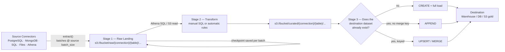
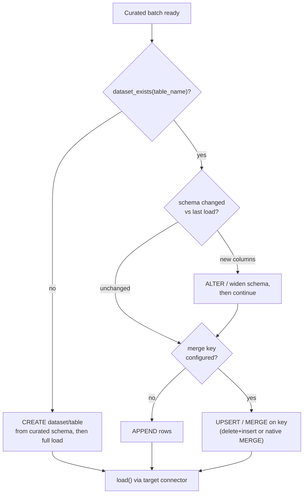
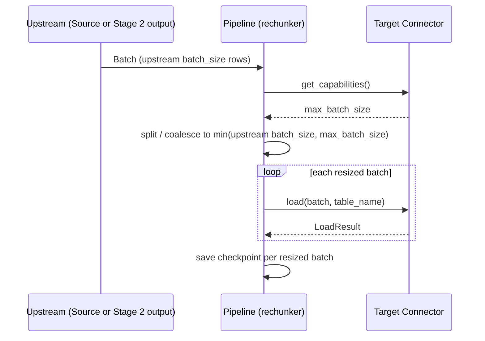

# Raw-to-Curated Pipeline: S3 Landing Zone Architecture

**Status:** Proposal
**Repos affected:** `udi-packages`, `udi-connectors`, `udi-etl-app`, `udi-etl-web`
**Date:** 2026-07-20

---

## 1. Why

Today, `migrate_all()` (`udi-connectors/src/udi_connectors/_registry.py:61`) is a single hop: it
connects one source and one target, and streams `extract()` batches straight into `target.load()`.
The API layer already special-cases this into a raw dump — `POST /connections/{id}/migrate`
(`udi-etl-app/api/routes/connections.py:181-205`) hardcodes `target="s3"` — so every connection's
data already lands on S3 as a side effect. What's missing is everything *after* that dump: there is
no stage that reads the raw S3 data back, transforms it, checks whether the destination dataset
already exists, and decides how to write into it.

This document proposes making that an explicit three-stage pipeline instead of an implicit one-hop
migration, reusing the `SourceConnector` / `TargetConnector` protocols already defined in
`udi-packages` rather than inventing new abstractions.

## 2. Architecture at a glance



Three stages, each a normal `SourceConnector` → `TargetConnector` hop using the existing protocol
in `udi-packages/src/udi_packages/source.py` and `target.py` — nothing new needs to be invented at
the connector level, only orchestration around it.

## 3. Stage 1 — Raw Landing (Bronze)

**What happens:** every connector, regardless of type, extracts and lands to S3 *as-is* — no
mapping, no filtering beyond what the source query already does. This is the existing
source → `S3Connector.load()` path (`udi-connectors/src/udi_connectors/s3/connector.py:85-121`),
batched at whatever `batch_size` the source config declares (20,000 for DB sources, 1,000 for
Athena, 100 for file uploads).

**Gap to fix — key structure.** Right now the S3 key is `{s3_folder or table_name}/{batch_id}.ext`,
and the API passes `s3_folder=task_id` (`udi-etl-app/api/tasks.py:44`). That makes every migration
run land in its own folder, which is fine for a one-off dump but unusable as a stable raw zone —
Stage 2 needs to query "all raw data for table X" across runs, ideally partitioned by date. Proposed
key layout:

```
s3://bucket/raw/{connection_id}/{table_name}/dt={extracted_at:%Y-%m-%d}/{batch_id}.parquet
```

This also makes the prefix directly usable as a Hive-partitioned Glue/Athena external table, which
is what Stage 2 reads from.

**Checkpointing:** unchanged — `CheckpointFile` (`udi-packages/src/udi_packages/checkpoint.py`)
already tracks the incremental cursor or processed-file list per table, so re-running Stage 1 only
lands new/changed rows.

## 4. Stage 2 — Transform (Silver)

**What happens:** read back from the raw zone and produce a cleaned, typed, deduplicated dataset,
written to a second S3 prefix (`curated/...`). This is another source → target hop, just with the
*source* now being the raw zone instead of the original system:

- **Reader:** the `AthenaConnector` (`udi-connectors/src/udi_connectors/athena/connector.py`) is
  already a registered `Source` that runs SQL over S3-backed tables — it's the natural transform
  engine, given a Glue table (or `CREATE TABLE ... LOCATION 's3://.../raw/...'`) over the Stage 1
  prefix. A lighter-weight direct S3 Parquet reader is a fallback for when Athena isn't provisioned.
- **Transform, manual:** a user-authored SQL statement (via the existing
  `POST /connections/{id}/query` Athena path, `udi-etl-app/api/routes/connections.py:155-178`) or a
  declarative column mapping (rename / cast / drop / filter) stored alongside the connection.
- **Transform, automatic:** a rules engine with no user input — infer schema from the batch,
  coerce types against the last-known schema, flatten nested structs, drop exact-duplicate rows by
  full-row hash (or a configured key), null-normalize. This is a good place to reuse
  `BatchMetadata.schema` (`udi-packages/src/udi_packages/batch.py:18`), which already carries the
  Arrow schema per batch.
- **Writer:** `S3Connector` again, pointed at `curated/{connection_id}/{table_name}/...`.

**Trigger:** manual (user clicks "transform" in `udi-etl-web`) to start, with a scheduled/event-driven
mode (S3 `ObjectCreated` → SQS → job) as a fast-follow once the manual path is proven out.

## 5. Stage 3 — Publish (Gold) and the "does it already exist" question

This is the part that was hard to put into words: **before loading the curated batch into the real
destination, the pipeline has to know whether that destination's dataset already exists**, because
that decides the write mode.



**What needs to be added:** the `TargetConnector` protocol
(`udi-packages/src/udi_packages/target.py:26`) currently has no way to ask "does this dataset
exist" or "what's its current schema" — it only has `connect` / `load` / `get_capabilities`. Propose
adding:

```python
async def dataset_exists(self, table_name: str) -> bool: ...
async def get_schema(self, table_name: str) -> pa.Schema | None: ...
```

For DB-family targets this is an information-schema lookup; for S3, existence = "does the prefix
have any objects." The merge key itself (if any) is a per-connection setting, not something a
connector can infer — it belongs in the transform config from Stage 2.

## 6. Batching by destination

The requirement to "batch according to destination batch size" is *already half-modeled* —
`TargetCapabilities.max_batch_size` (`udi-packages/src/udi_packages/target.py:19-23`) exists — but
it is currently declared and never enforced. Batch size today is decided entirely by the *source*:

| Connector | Role | `batch_size` (source) | `max_batch_size` (target) |
|---|---|---|---|
| postgresql | source | 20,000 | — |
| mongodb | source | 20,000 | — |
| sql | source | 20,000 | — |
| athena | source | 1,000 | — |
| file_upload | source | 100 | — |
| s3 | target | — | 100,000 |

That happens to work today because every current target is S3 with a large ceiling. It breaks the
moment a destination with a smaller row-per-write limit (a warehouse `INSERT` batch cap, an API
target with a payload size limit) is added upstream of it — a 20,000-row batch from Postgres would
get pushed at a target that can't take it.

**Proposed fix:** a rechunk step between "batches arrive from upstream" and "batches get loaded,"
sized to `min(configured_batch_size, target.get_capabilities().max_batch_size)`:



This slots into `migrate_all` right where it currently does `async for batch in result.batches:`
(`udi-connectors/src/udi_connectors/_registry.py:100`) — instead of loading each source batch
1:1, the rechunker buffers/splits Arrow tables to the target's ceiling before calling `load()`.

## 7. Implementation checklist by repo

**`udi-packages`**
- [ ] Add `dataset_exists()` and `get_schema()` to `TargetConnector` protocol
- [ ] Add a `rechunk(batches, size) -> AsyncIterator[Batch]` utility (Arrow table slice/concat)
- [ ] Extend `BatchMetadata` / config with a `zone` marker (`raw` / `curated`) for traceability

**`udi-connectors`**
- [ ] Stable raw-zone key layout in `S3Connector` (`connection_id/table/dt=.../batch_id`)
- [ ] Implement `dataset_exists` / `get_schema` for `s3`, `postgresql`, `sql`, `mongodb`, `athena`
- [ ] New `migrate_raw_to_curated()` (or extend `migrate_all`) that wires Stage 2 as
      Athena/S3-source → S3-target with a transform hook (SQL string or mapping dict)
- [ ] Upsert/merge write mode on DB-family targets (currently only append-style `load()` exists)

**`udi-etl-app`**
- [ ] New route(s): `POST /connections/{id}/transform` (Stage 2, manual trigger) and
      `POST /connections/{id}/publish` (Stage 3, exists-check + load)
- [ ] Store transform rules (manual SQL or mapping) and merge-key config per connection in
      `metadata_storage.py`
- [ ] Surface per-stage status (`landed` / `transformed` / `published`) instead of the current
      single `running`/`completed`/`failed` task state (`api/tasks.py:15-19`)

**`udi-etl-web`**
- [ ] Pipeline view showing the three stages per connection with their own status/timestamps
- [ ] Transform editor (SQL box for manual, toggle + rule list for automatic)
- [ ] Surface exists-check outcome (Create / Append / Upsert) before a Stage 3 run, for visibility

## 8. Open questions

1. **Transform trigger:** manual-only to start, or build the S3-event trigger in the same pass?
2. **Merge key source of truth:** set per-connection once, or per-table (some tables in a DB
   connection might be append-only, others keyed)?
3. **Curated zone format:** keep Parquet/Snappy for curated too, or does a downstream consumer
   (BI tool, warehouse `COPY`) want something else?
4. **Athena provisioning:** does every environment have Glue Catalog + Athena workgroup available,
   or does Stage 2 need the "direct S3 reader" fallback as the default rather than a fallback?
